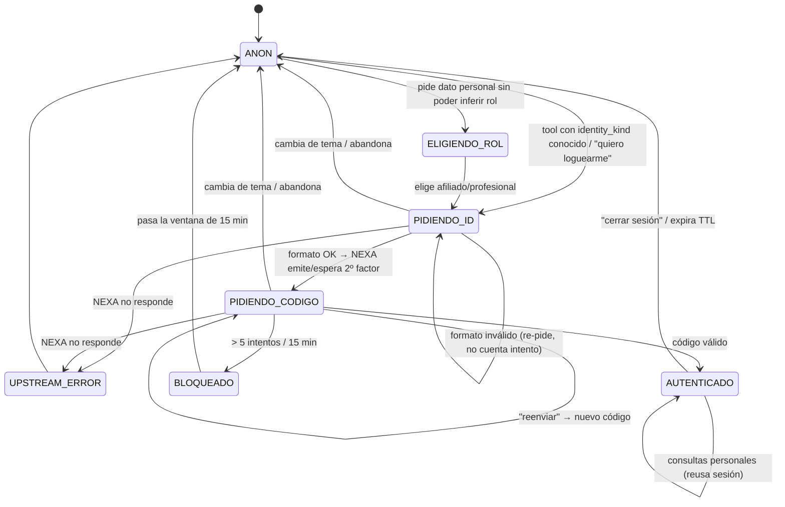

# FSM de login conversacional — diseño (revisar antes de codear)

> Documento de diseño de la Fase 1 (tareas 1.3 FSM afiliado, 1.4 session store) y
> Fase 2 (2.2 FSM profesional). Define la máquina de estados y **los mensajes
> exactos** del bot en cada transición, para revisar la conversación en papel
> antes de implementar. Todo se prueba en local; no depende de NEXA para revisar
> el flujo (los mensajes y estados son nuestros; NEXA solo valida el 2º factor).

## Principio rector

El **nombre no autentica**. La identidad se prueba SIEMPRE con un segundo factor
validado por NEXA. La sesión resultante guarda `identity` server-side; el LLM y el
usuario nunca la tocan. Ante cualquier duda o fallo → **fail-closed** (no se
invoca la tool).

## Los dos flujos

| | Afiliado | Profesional |
|---|---|---|
| 1er dato | DNI (7-8 dígitos) | CUIT (11 dígitos) |
| 2º factor | TOTP (app/token) | OTP por email/SMS (lo envía NEXA) |
| `identity_kind` | `afiliado` | `profesional` |

La máquina de estados es **la misma**; solo cambian qué se pide y el mensaje.

## Diagrama de estados



## Catálogo de mensajes exactos

Los mensajes se arman desde una plantilla parametrizada por el **identificador del
conector** (`identity_spec` en `connector_router.py`). Por default: afiliado → DNI
(7-8 dígitos), profesional → CUIT (11). Un conector cuyo proveedor identifica por
otro dato (legajo, nro de socio…) lo configura en `auth_config`: `identity_label`
(+ opcionales `identity_min_digits` / `identity_max_digits`; sin ellos, un label
custom acepta 3-12 dígitos). El wizard de conexión automática lo detecta solo desde
el nombre del parámetro en el API, y también se edita en `/admin/connectors/{id}`.

### Entrada al FSM

**Disparado por una tool que necesita identidad (identity_kind conocido → afiliado):**
> Para darte esa información necesito identificarte primero. ¿Me pasás tu **DNI** (7 u 8 números, sin puntos)?

_(con identificador custom: "… ¿Me pasás tu **legajo** (entre 4 y 6 números, solo números)?")_

**Disparado por "quiero loguearme" sin contexto de rol → ELIGIENDO_ROL:**
> Perfecto. ¿Ingresás como **afiliado** o como **profesional**?
> _(chips sugeridos: [Afiliado] [Profesional])_

**Rol = profesional → PIDIENDO_ID:**
> Para darte esa información necesito identificarte primero. ¿Me pasás tu **CUIT** (11 números, sin guiones)?

### Estado PIDIENDO_ID

| Situación | Mensaje del bot |
|---|---|
| Formato inválido (fuera del rango de dígitos) | Ese {DNI/CUIT/legajo…} no parece válido. Debería tener {7 u 8 / 11 / …} números, {sin puntos/…}. ¿Lo intentás de nuevo? |
| Formato OK → pide 2º factor (afiliado/TOTP) | Gracias. Ahora ingresá el **código de 6 dígitos** de tu app de autenticación. |
| Formato OK → pide 2º factor (profesional/OTP) | Listo. Te envié un **código a tu email/SMS registrado**. ¿Cuál es? |

> **Sobre "el DNI no existe":** no confirmamos ni negamos si un DNI está registrado
> (evita enumeración de afiliados). Si NEXA dice que no existe, el bot igual pide
> el código y recién falla en el paso de validación con un mensaje neutro. El
> comportamiento exacto se ajusta al contrato real de NEXA en Fase 1.

### Estado PIDIENDO_CODIGO

| Situación | Mensaje del bot |
|---|---|
| Código incorrecto (quedan intentos) | Ese código no coincide. Te quedan **{n} intentos**. Revisá y volvé a ingresarlo. |
| Usuario escribe "reenviar" / "no me llegó" | Te reenvié un código nuevo. Revisá tu {app / email / SMS} e ingresalo acá. |
| Código válido → AUTENTICADO | ✅ Listo, {nombre}. Ya estás identificado por unos minutos. {responde lo que había pedido} |
| Código vencido | Ese código ya venció. Te mando uno nuevo… ingresá el que acabás de recibir. |

### Estado BLOQUEADO (throttle: 5 intentos / 15 min)

> Por seguridad bloqueé los intentos por **15 minutos**. Si no reconocés esta
> actividad, comunicate con la Mutual. Podés reintentar más tarde.

### Estado UPSTREAM_ERROR (NEXA caído — fail-closed)

> No puedo verificar tu identidad en este momento por un problema técnico.
> Probá de nuevo en unos minutos. Mientras tanto puedo ayudarte con información
> general (coberturas, requisitos, horarios).

> ⚠️ Fail-closed: si no podemos validar, **no** se entrega ningún dato personal.
> Se degrada a lo público (RAG), nunca se "asume" identidad.

### Ya autenticado — más consultas

Consulta personal dentro de la sesión activa → responde directo, **sin** re-pedir DNI.

### Expiración de sesión (re-auth transparente)

Nueva consulta personal después de vencido el TTL:
> Tu sesión expiró por seguridad. Para seguir, pasame de nuevo tu **DNI**.

### Cerrar sesión

Usuario: "cerrar sesión" / "salir"
> Cerré tu sesión. Tus datos personales quedan protegidos. ¿Algo más?

## Manejo de salidas del flujo (robustez conversacional)

- **Cambia de tema en medio del login** (ej. estaba en PIDIENDO_CODIGO y pregunta
  "¿qué cubre el plan?"): el bot **abandona el FSM**, responde la pregunta pública
  y no queda trabado esperando el código. Si después vuelve a pedir algo personal,
  reinicia el FSM desde donde corresponde.
- **Manda basura** (texto que no es DNI ni código): re-pide con el mensaje del
  estado actual, sin contar intento contra NEXA (los intentos solo cuentan sobre
  el 2º factor, no sobre formato).
- **Abandono / silencio:** el estado del FSM vive en la sesión con TTL corto; si no
  completa, expira solo y vuelve a ANON.

## Ciclo de vida de la sesión (tarea 1.4)

- **Store:** Redis (DB dedicada), blob **cifrado con Fernet**:
  `{ jwt_nexa, identity, rol, exp }`. Nunca en claro.
- **TTL:** configurable, 15-30 min (`SESSION_TTL_MIN`). Se renueva con actividad.
- **Doble token:** nuestra sesión (Redis, cifrada) **envuelve** el JWT de NEXA. El
  usuario nunca ve el JWT de NEXA; nosotros lo usamos server-side para las tools.
- **Resolución `{identity}`:** el executor lee `identity` de la sesión y lo sustituye
  en el `path_template`. El LLM no la ve ni la puede pedir (defensa BOLA/IDOR).

## Seguridad transversal (tarea 1.7)

- **PII scrubber:** DNI, CUIT y códigos **nunca** se loguean en claro ni quedan en
  el historial de la conversación (se enmascaran: `DNI ****1222`).
- **El código nunca se persiste:** se manda a NEXA para validar y se descarta.
- **Auditoría:** cada intento (ok / incorrecto / bloqueado / upstream) va a
  `tool_call_audit` con `actor_ref` hasheado — sirve para detectar sondeo BOLA
  (muchos `forbidden`/`auth_required` del mismo actor).
- **Throttle:** 5 intentos / 15 min por actor (Redis DB de rate limiting, la que ya
  existe).

## Qué revisar antes de codear (checklist para vos)

- [ ] ¿Los mensajes suenan bien para un afiliado de la Mutual? (tono, claridad)
- [ ] ¿El bloqueo de 15 min / 5 intentos es el umbral que querés?
- [ ] ¿TTL de sesión: 15 o 30 min?
- [ ] ¿"cerrar sesión" y "reenviar código" como frases gatillo alcanzan, o querés más?
- [ ] Confirmar con NEXA: ¿el OTP de profesional lo envían ellos? ¿formato del código?
      ¿qué devuelve `validarTotp` (ok/expired/wrong)? ¿enumera DNIs o no?
```
